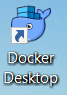

# Installing Docker on a Windows 10 PC

Docker is a full development platform for creating containerized apps, and Docker Desktop for Windows is the best way to get started with Docker on _Windows_.

To check if you have Docker already installed on your system open a terminal window by navigating to Command Prompt with clicking on: Start >> Type "cmd" >> Right click on "Command Prompt", select "Run as Administrator" and select "Yes" to open Command Prompt as an Administrator.

In the terminal type:

```
docker --version
```

If you see the following output:


Then you need to install docker.

## First make sure your PC satisfies the following minimum system requirements:

- Windows 10 64bit: Pro, Enterprise or Education (1607 Anniversary Update, Build 14393 or later).

- Virtualization is enabled in BIOS. Typically, virtualization is enabled by default. This is different from having Hyper-V enabled. For more detail see [Virtualization must be enabled](https://docs.docker.com/docker-for-windows/troubleshoot/#virtualization-must-be-enabled) in Troubleshooting.

- CPU SLAT-capable feature.

- At least 4GB of RAM.

Before downloading it is best if you create a Docker account by filling out this [form](https://hub.docker.com/signup) and then signing in with the newly created account.

Next follow [this](https://hub.docker.com/editions/community/docker-ce-desktop-windows) link to go to the Docker Desktop for Windows download page and click on the "Get Docker" button to begin downloading


Navigate to the directory of your download and double click on the installation file


The following screen will appear


Followed by this one:


Click the "Ok" button to accept the default configuration.

Docker for Windows will now install


Depending on your PC configuration this process should finish relatively fast

After it is finished you will get the following screen


Click "Close"

Open Docker Desktop


