# Installing Docker on a Windows 10 PC

Docker is a full development platform for creating containerized apps, and Docker Desktop for Windows is the best way to get started with Docker on _Windows_.

To check if you have Docker already installed on your system open a terminal window by navigating to Command Prompt by clicking on: Start >> Type "cmd" >> Right click on "Command Prompt", select "Run as Administrator" and select "Yes" to open Command Prompt as an Administrator.

---

In the terminal type:

```
docker --version
```

If you see the following output:

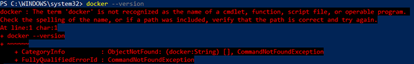

Then you need to install docker.

To find out more about Docker for Windows you can follow the steps below or watch this YouTube video:

[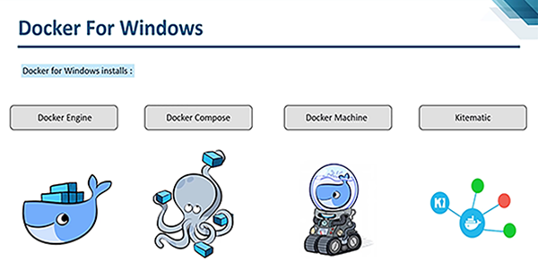](https://youtu.be/iJeL2tOFfvM?t=14 "Docker for Windows 10")

---

## First make sure your PC satisfies the following minimum system requirements:

- Windows 10 64bit: Pro, Enterprise or Education (1607 Anniversary Update, Build 14393 or later).

- Virtualization is enabled in BIOS. Typically, virtualization is enabled by default. This is different from having Hyper-V enabled. For more detail see [Virtualization must be enabled](https://docs.docker.com/docker-for-windows/troubleshoot/#virtualization-must-be-enabled) in Troubleshooting.

- CPU SLAT-capable feature.

- At least 4GB of RAM.

Before downloading it is best if you create a Docker account by filling out this [form](https://hub.docker.com/signup) and then signing in with the newly created account.

Next follow [this](https://hub.docker.com/editions/community/docker-ce-desktop-windows) link to go to the Docker Desktop for Windows download page and click on the "Get Docker" button to begin downloading

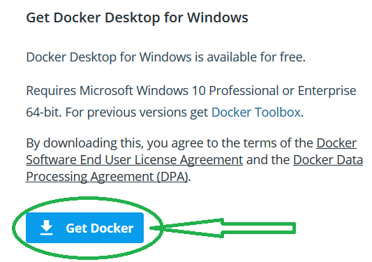

Navigate to the directory of your download and double click on the installation file

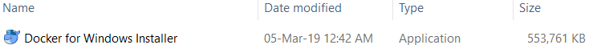

The following screen will appear

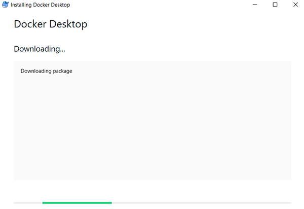

Followed by this one:

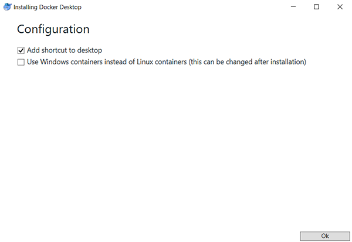

Click the "Ok" button to accept the default configuration.

Docker for Windows will now install

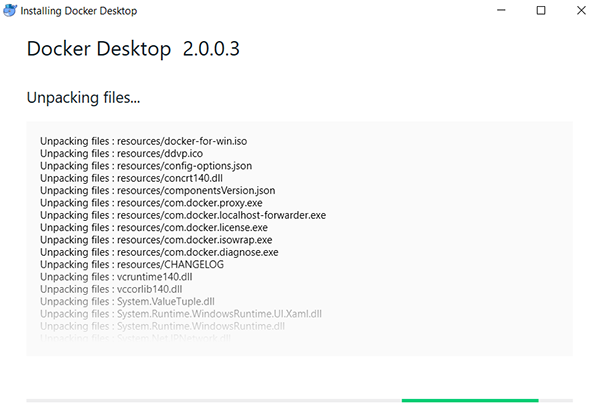

Depending on your PC configuration this process should finish relatively fast

After it is finished you will get the following screen

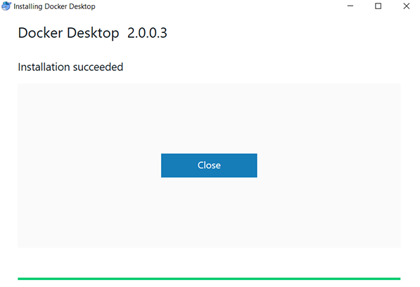

Click "Close".

To start the program navigate to the directory you installed the Docker in and open the "Docker for Windows" file

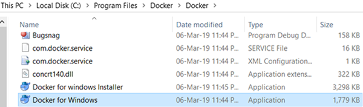

The following screen should appear on the bottom right of your screen

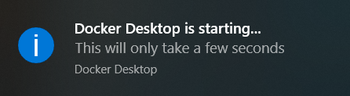

Followed by the welcome pop-up

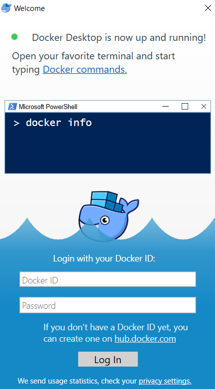

Enter your credentials to log in.

**With that your Docker is set up and you can start using it.**

---

Next we need to pull the container image.

In the "Command Prompt" type:

```
docker pull registry.gitlab.com/librehealth/toolkit/lh-toolkit-docker:latest
```

You should see a similar output:

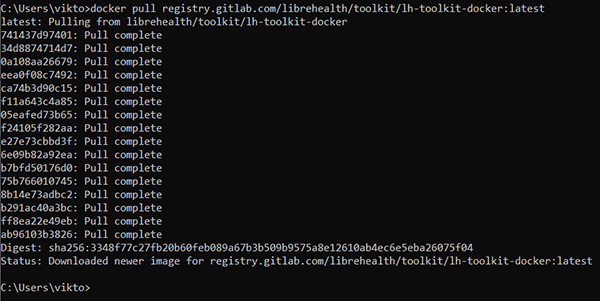

Navigate to the directory where you cloned the repository.

There are two ways to interact with the container:

1. Run the container in the foreground:

```
docker-compose -f docker-compose.dev.yml up
```

A similar output should occur:

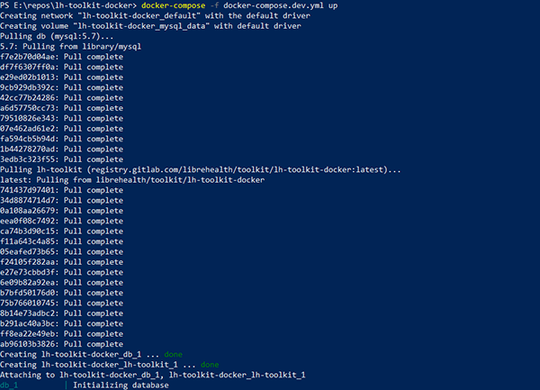

A pop-up will appear asking whether you want to share drive. Select "Share it" to continue.

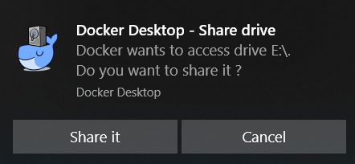

If your PC is password protected you should see this pop-up as well.

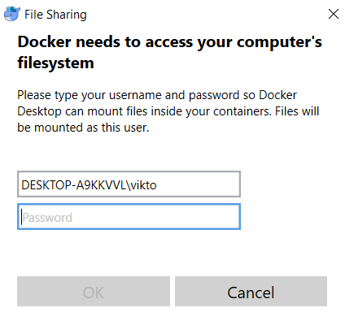

Fill it with your credentials.

Next MySQL will be started followed by lh-toolkit on the containers.

2. Run the container in the background:

```
docker-compose -f docker-compose.dev.yml up -d
```

A similar output should occur:

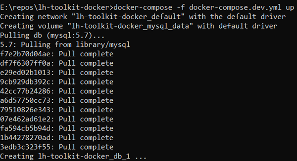

In order to stop the container at any time type `ctrl+c` in the "Command Prompt" window.

The follwing will be shown in that case:

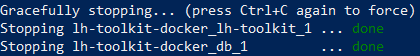

---

### Using lh-toolkit

To start using lh-toolkit, open a tab with this address: [http://localhost:8080/lh-toolkit/](http://localhost:8080/lh-toolkit/) then log in with the following credentials:

- **User**: admin
- **Pass**: Admin123


The following will occur after a successful log in


## Bringing container down

---

To bring the container down and to free space on your machine run:

```
docker-compose down
```

You should see a similar output:

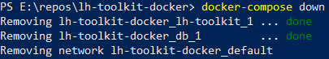

## Troubleshooting

---

When you are pulling the container image, the directory you are in does not matter.
However, if you try to run this docker image from outside of this project directory, you will get the following error:

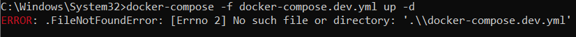

To avoud it make sure you're in the right directory and enter the command again.

If you try to pull an image before starting the Docker Daemon, you will see a similiar error to this one:

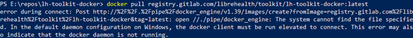

Navigate to the directory you installed the Docker in and open the "Docker for Windows" file.

You might see a similar warning on older systems:

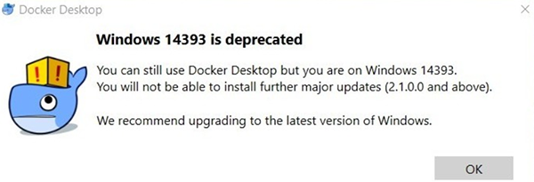

Ignore it or update your system and continue to the next step.
